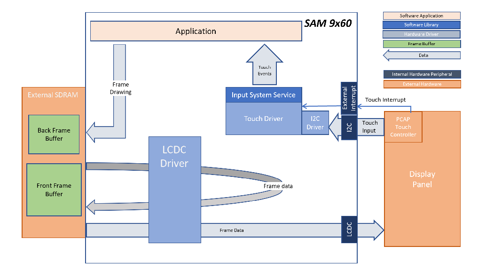
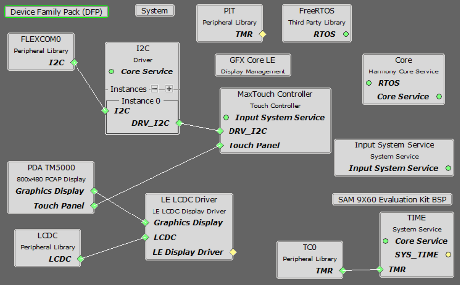
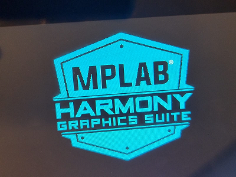

 blank\_qs\_db\_9x60\_ek\_tm5000.X

Defining the Architecture
-------------------------

The application calls directly into LCD Controller (LCDC) driver set up and initialization function calls that configure the LCDC. After initialization, the application transitions into the paint phase, where it draws an image to the frame buffer. The application uses a gfx_driver API to write pixel data directly to the frame buffer memory address.
Touching the LCD turns ON the BLUE LED and changes the image displayed.

This application also shows how to use double buffering to eliminate screen tearing. 

User touch input on the display panel is received thru the PCAP capacitive touch controller, which sends a notification to the Touch Input Driver. The Touch Input Driver reads the touch information over I2C and sends the touch event to the Graphics Library thru the Input System Service.

### Demonstration Features

-   Graphics Acceleration using integrated display controller (LCDC)
-   Double Buffering
-   Reference application for the SAM 9x60
-   24-bit color, multi-layer, WVGA (800x480) screen design
-   Time system service, timer-counter peripheral library and driver 
-   I2C and touch controller driver 

Creating the Project Graph
--------------------------

The Project Graph diagram shows the Harmony components that are included in this application. Lines between components are drawn to satisfy components that depend on a capability that another component provides.

Building the Application
------------------------

The parent directory for this application is gfx/apps/blank\_quickstart\_db. To build this application, use MPLAB X IDE to open the gfx/apps/blank\_quickstart\_db/firmware/blank\_qs\_9x60\_ek\_tm5000.X project folder and press F11.
A successful build will generate a harmony.bin file in dist\lcdc_rgba8888_mxt_9x60_wvga\production in the project folder.

The following table lists configuration properties:

|Project Name|BSP Used|Graphics Template Used|Description|
|:-----------|:-------|:---------------------|:----------|
|blank\_qs\_db\_9x60\_ek\_tm5000.X|SAM 9x60 Evaluation Kit|None|SAM 9x60 Evaluation Kit with RGBA8888 GFX Interface and 5" WVGA PCAP Touch display|

Configuring the Hardware
------------------------

Configure the hardware as follows:

-   Connect the ribbon cable from the display to the J15 connector on the back of the SAM 9x60 Evaluation Kit board.

-	Take an SD Card formatted with FAT32 file system, and copy the boot.bin binary file from this [location](../../../boot_image/boot.bin). Also copy the harmony.bin file you generated from the "Building the Application" section.

-   Insert the SD card to J4 of the SAM 9X60 Evaluation kit and power up the board by connecting the power adapter to power connector or a powered USB cable to the USB port on the SAM 9x60 Evaluation Kit board.

Running the Demonstration
-------------------------

When power-on is successful, the demonstration will display an image similar to the following picture (different configurations may have slight variation in the screen aspect ratio):

When the LCD is pressed, the blue LED turns ON and the image displayed changes to the following picture:

With each touch to the LCD, the image displayed will swap between the two pictures shown above.
* * * * *

 
