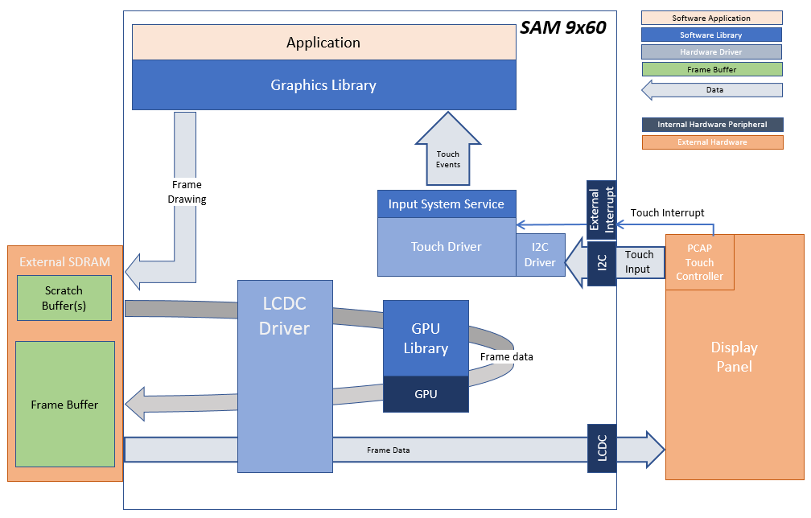
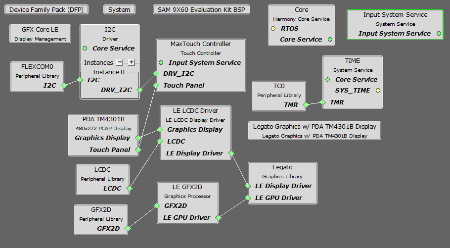
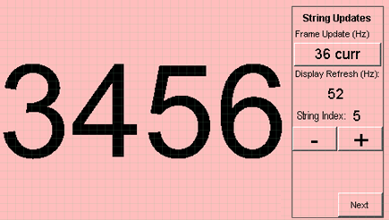
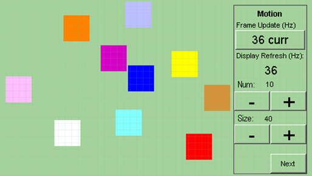

 legato\_benchmark\_9x60\_ek\_tm4301b.X

Defining the Architecture
-------------------------

This application demonstrates multi-layer, WQVGA graphics using internal SRAM only without the need for DDR memory.

User touch input on the display panel is received thru the PCAP capacitive touch controller, which sends a notification to the Touch Input Driver. The Touch Input Driver reads the touch information over I2C and sends the touch event to the Graphics Library thru the Input System Service.

### Demonstration Features

-   Legato Graphics Library
-   Reference application for the SAM 9x60
-   24-bit color, WQVGA (480x272) screen design
-   Time system service, timer-counter peripheral library and driver 
-   Graphics Acceleration using integrated display controller (LCDC)
-   Graphics Acceleration using graphics processor (GFX2D)
-   I2C and touch controller driver 
-   RAW, RAW RLE images 

Creating the Project Graph
--------------------------

The Project Graph diagram shows the Harmony components that are included in this application. Lines between components are drawn to satisfy components that depend on a capability that another component provides.

Adding the **SAM 9x60 Evaluation Kit BSP** and **Legato Graphics w/ PDA TM4301b Display** Graphics Template component into the project graph will automatically add the components needed for a graphics project and resolve their dependencies. It will also configure the pins needed to drive the external peripherals like the display and the touch controller.

Building the Application
------------------------

The parent directory for this application is gfx/apps/legato\_benchmark. To build this application, use MPLAB X IDE to open the gfx/apps/legato\_benchmark/firmware/legato\_bm\_9x60\_ek\_tm4301b.X project file.

The following table lists configuration properties:

|Project Name|BSP Used|Graphics Template Used|Description|
|:-----------|:-------|:---------------------|:----------|
|legato\_bm\_9x60\_ek\_tm4301b.X|SAM 9x60 Evaluation Kit|Legato Graphics w/ PDA TM4301b Display|SAM 9x60 Evaluation Kit with RGBA8888 GFX Interface and 4.3" WQVGA PCAP Touch display|

> \*\*\_NOTE:\_\*\* This application may contain custom code that is marked by the comments // START OF CUSTOM CODE ... and // END OF CUSTOM CODE. When using the MPLAB Harmony Configurator to regenerate the application code, use the "ALL" merging strategy and do not remove or replace the custom code.

Configuring the Hardware
------------------------

The final setup should be:

Configure the hardware as follows:

-   Connect the ribbon cable from the display to the J16 connector on the back of the SAM 9x60 Evaluation Kit board.

-   Power up the board by connecting the power adapter to power connector or a powered USB cable to the USB port on the SAM 9x60 Evaluation Kit board.

Running the Demonstration
-------------------------

When power-on is successful, the demonstration will display a similar screens to the ones shown (different configurations may have slight variation in the screen aspect ratio):

* * * * *
